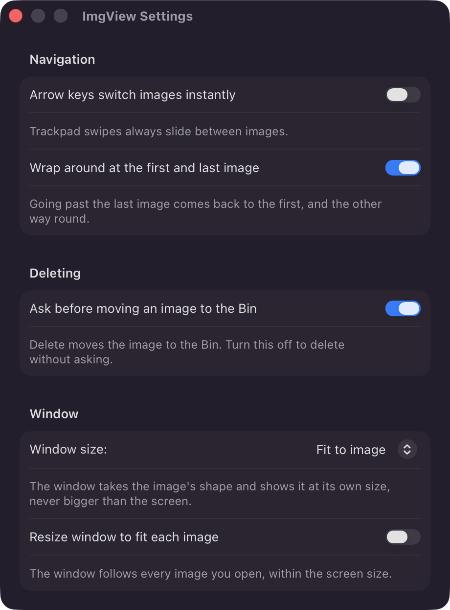

<p align="center">
  
</p>

<h1 align="center">Siiv</h1>

Siiv (Simple Image Viewer) is a small macOS image viewer. Open an image, then
move through the folder with the arrow keys or a trackpad swipe. Simple as.
## Install

Download the `.dmg` from [Releases](../../releases), open it, and drag Siiv
into Applications. Needs macOS 14 (Sonoma) or newer. I think.

The app is not signed with a paid Apple developer account, so macOS stops it the first time. Open it once from **System Settings → Privacy & Security → Open Anyway**, or clear the quarantine
flag yourself:

```sh
xattr -dr com.apple.quarantine /Applications/Siiv.app
```

## Shortcuts

| Key | Function |
| --- | --- |
| `←` `→` or `↑` `↓` | Previous / next image |
| `Home` `End` or `⌘←` `⌘→` | First / last image |
| `F` or double click | Fullscreen |
| `Esc` | Leave fullscreen, otherwise quit |
| `⌫` | Move the image to the Bin |
| `O` | Open with another app |
| `S` | Show the Share popup |
| `⌘O` | Open an image |
| `⌘,` | Settings |

On the trackpad: swipe sideways to change image, pinch to zoom, two-finger
double tap to zoom in and out.

## Settings



## Build it yourself

```sh
scripts/package.sh          # writes dist/Siiv-<version>.dmg
```

Built with Xcode 27; needs Xcode 16 or newer for the project format.

## License

[MIT](LICENSE). Do what you like with it.
